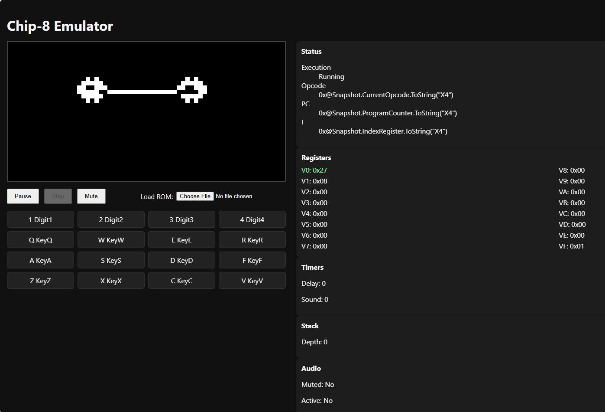

# Chip-8 Browser Emulator

A Chip-8 emulator implemented in C# with a WebAssembly front end. The core interpreter runs inside `Chip8.Emulator.Core` while `Chip8.Emulator.Web` hosts a Blazor UI exposing the display, HUD telemetry, and keyboard controls directly in the browser.

This project was completely vibe coded. I did not personally write a single line of code. I planned it with [Github Spec Kit](https://github.com/github/spec-kit) using Codex as the ai agent. Total time to create the project, including bug fixing and general tweaks and improvements, was about 4 hours.



## Requirements
- .NET 8 SDK
- Node.js 18+ (for Playwright integration tests)

## Quick Start
```bash
# Restore and build everything
dotnet build chip8.sln

# Run unit + ROM compatibility suites
dotnet test chip8.sln

# Launch the WebAssembly UI (default 5173)
dotnet run --project src/Chip8.Emulator.Web/Chip8.Emulator.Web.csproj --urls http://localhost:5173
```
Open the printed URL in a browser, load a `.ch8` ROM via the file picker, and use the classic keypad layout (default mapping: `1234/QWER/ASDF/ZXCV`).

## Playwright Integration Tests
```bash
npm install
npx playwright install
CHIP8_WEB_PORT=5179 npx playwright test --config=tests/Integration/playwright.config.ts
```

## ROM Assets
Place Chip-8 ROMs in `tests/Rom/Assets/`. The ROM test project copies them into the output directory for compatibility runs.

## License
MIT (see `LICENSE` if present).
